# Diagramas UML — Sistema Inteligente de Gerenciamento de Condomínios

## 1. Diagrama de Casos de Uso

```mermaid
flowchart LR
    Morador((Morador))
    Sindico((Síndico))

    UC1[Autenticar-se]
    UC2[Cadastrar unidades e moradores]
    UC3[Cadastrar áreas comuns]
    UC4[Solicitar reserva de área comum]
    UC5[Abrir chamado de manutenção]
    UC6[Consultar regimento via assistente virtual]
    UC7[Gerenciar chamados de manutenção]
    UC8[Visualizar painel de chamados]
    UC9[Atualizar regimento interno]
    UC10[Consultar histórico de reservas e chamados]
    UC11[Exportar relatório de chamados]

    Morador --> UC1
    Morador --> UC4
    Morador --> UC5
    Morador --> UC6
    Morador --> UC10

    Sindico --> UC1
    Sindico --> UC2
    Sindico --> UC3
    Sindico --> UC7
    Sindico --> UC8
    Sindico --> UC9
    Sindico --> UC11
```



## 2. Diagrama de Classes

```mermaid
class Usuario {
    +id: int
    +nome: string
    +email: string
    +senhaHash: string
    +perfil: enum
  }

  class Condomínio {
    +id: int
    +nome: string
    +endereco: string
  }

  class Unidade {
    +id: int
    +bloco: string
    +numero: string
  }

  class Morador {
    +id: int
    +cpf: string
    +nome: string
  }

  class AreaComum {
    +id: int
    +nome: string
    +capacidadeMaxima: int
    +horarioLimiteUso: time
  }

  class Reserva {
    +id: int
    +data: date
    +horaInicio: time
    +horaFim: time
    +status: enum
  }

  class Chamado {
    +id: int
    +categoria: string
    +localizacao: string
    +descricao: string
    +status: enum
    +observacao: string
    +justificativaCancelamento: string
    +dataAbertura: datetime
  }

  class Regimento {
    +id: int
    +nomeArquivo: string
    +caminhoArquivo: string
    +dataAtualizacao: datetime
  }

  class AssistenteVirtual {
    +consultarRegimento(pergunta: string) string
  }

  class Historico {
    +id: int
    +tipo: enum
    +data: datetime
    +status: enum
  }

  Usuario <|-- Morador
  Usuario <|-- Sindico

  class Sindico {
    +id: int
    +nome: string
  }

  Condomínio "1" -- "N" Unidade : possui
  Unidade "1" -- "N" Morador : vincula
  Condomínio "1" -- "N" AreaComum : disponibiliza
  Morador "1" -- "N" Reserva : solicita
  AreaComum "1" -- "N" Reserva : recebe
  Morador "1" -- "N" Chamado : abre
  Sindico "1" -- "N" Chamado : gerencia
  Condomínio "1" -- "N" Chamado : possui
  Condomínio "1" -- "N" Regimento : possui
  Regimento "1" -- "1" AssistenteVirtual : fornece contexto
  Morador "1" -- "N" Historico : consulta
  Reserva "1" -- "N" Historico : registra
  Chamado "1" -- "N" Historico : registra
```

## 3. Rastreabilidade — caso de uso → história do backlog
| Caso de uso | História(s) relacionada(s) (E2) |
|---|---|
| Autenticar-se | #1 |
| Cadastrar unidades e moradores | #2 |
| Cadastrar áreas comuns | #3 |
| Solicitar reserva de área comum | #4 |
| Abrir chamado de manutenção | #5 |
| Consultar regimento via assistente virtual | #6 |
| Gerenciar chamados de manutenção | #7 |
| Visualizar painel de chamados | #8 |
| Atualizar regimento interno | #9 |
| Consultar histórico de reservas e chamados | #10 |
| Exportar relatório de chamados | #11 |