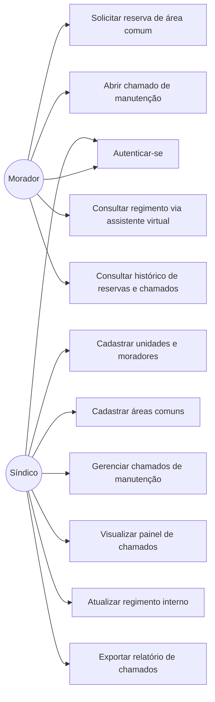

# Diagramas UML — Sistema Inteligente de Gerenciamento de Condomínios

## Escopo da Sprint 1
A Sprint 1 prioriza o núcleo operacional do condomínio: autenticação, cadastro e vinculação de usuários, gestão de unidades, acompanhamento de chamados e consulta do regimento interno. As entidades de áreas comuns e reservas já estão modeladas no DER para evolução posterior, mas o foco desta etapa está no fluxo de operação e acompanhamento do condomínio.

## 1. Diagrama de Casos de Uso



## 2. Diagrama de Classes

```mermaid
class Usuario {
    +id: int
    +nome: string
    +email: string
    +senhaHash: string
    +perfil: enum
}

class Condomínio {
    +id: int
    +nome: string
    +endereco: string
}

class Unidade {
    +id: int
    +bloco: string
    +numero: string
}

class Morador {
    +id: int
    +cpf: string
    +nome: string
}

class AreaComum {
    +id: int
    +nome: string
    +capacidadeMaxima: int
    +horarioLimiteUso: time
}

class Reserva {
    +id: int
    +data: date
    +horaInicio: time
    +horaFim: time
    +status: enum
}

class Chamado {
    +id: int
    +categoria: string
    +localizacao: string
    +descricao: string
    +status: enum
    +observacao: string
    +justificativaCancelamento: string
    +dataAbertura: datetime
}

class Regimento {
    +id: int
    +nomeArquivo: string
    +caminhoArquivo: string
    +dataAtualizacao: datetime
}

class AssistenteVirtual {
    +consultarRegimento(pergunta: string) string
}

class Historico {
    +id: int
    +tipo: enum
    +data: datetime
    +status: enum
}

class Sindico {
    +id: int
    +nome: string
}

Usuario <|-- Morador
Usuario <|-- Sindico

Condomínio "1" -- "N" Unidade : possui
Unidade "1" -- "N" Morador : vincula
Condomínio "1" -- "N" AreaComum : disponibiliza
Morador "1" -- "N" Reserva : solicita
AreaComum "1" -- "N" Reserva : recebe
Morador "1" -- "N" Chamado : abre
Sindico "1" -- "N" Chamado : gerencia
Condomínio "1" -- "N" Chamado : possui
Condomínio "1" -- "N" Regimento : possui
Regimento "1" -- "1" AssistenteVirtual : fornece contexto
Morador "1" -- "N" Historico : consulta
Reserva "1" -- "N" Historico : registra
Chamado "1" -- "N" Historico : registra
```

## 3. Rastreabilidade — caso de uso → história do backlog
| Caso de uso | História(s) relacionada(s) (E2) |
|---|---|
| Autenticar-se | #1 |
| Cadastrar unidades e moradores | #2 |
| Cadastrar áreas comuns | #3 |
| Solicitar reserva de área comum | #4 |
| Abrir chamado de manutenção | #5 |
| Consultar regimento via assistente virtual | #6 |
| Gerenciar chamados de manutenção | #7 |
| Visualizar painel de chamados | #8 |
| Atualizar regimento interno | #9 |
| Consultar histórico de reservas e chamados | #10 |
| Exportar relatório de chamados | #11 |