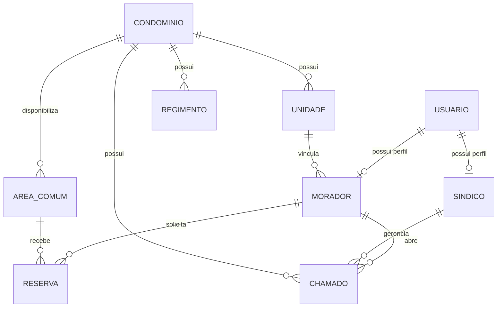

# DER — Sistema Inteligente de Gerenciamento de Condomínios

## Escopo da Sprint 1
A Sprint 1 prioriza o núcleo operacional do condomínio: cadastro e relacionamento entre usuários, condomínios, unidades e chamados. A camada de reservas e áreas comuns permanece modelada no DER para expansão, mas o entregável da sprint foca em gestão do condomínio, manutenção e consulta do regimento.

## 1. Diagrama

## 2. Dicionário de dados

### Tabela: USUARIO
| Campo | Tipo | Restrições | Descrição |
|---|---|---|---|
| id | INT | PK, AUTO_INCREMENT | Identificador único do usuário |
| nome | VARCHAR(100) | NOT NULL | Nome completo do usuário |
| email | VARCHAR(150) | NOT NULL, UNIQUE | E-mail utilizado para autenticação |
| senha_hash | VARCHAR(255) | NOT NULL | Senha armazenada em formato criptografado/hash |
| perfil | ENUM | NOT NULL | Perfil de acesso: MORADOR ou SINDICO |

### Tabela: CONDOMINIO
| Campo | Tipo | Restrições | Descrição |
|---|---|---|---|
| id | INT | PK, AUTO_INCREMENT | Identificador único do condomínio |
| nome | VARCHAR(150) | NOT NULL | Nome do condomínio |
| endereco | VARCHAR(255) | NOT NULL | Endereço do condomínio |

### Tabela: UNIDADE
| Campo | Tipo | Restrições | Descrição |
|---|---|---|---|
| id | INT | PK, AUTO_INCREMENT | Identificador único da unidade |
| condominio_id | INT | FK, NOT NULL | Condomínio ao qual a unidade pertence |
| bloco | VARCHAR(20) | NOT NULL | Identificação do bloco |
| numero | VARCHAR(20) | NOT NULL | Número da unidade |

### Tabela: MORADOR
| Campo | Tipo | Restrições | Descrição |
|---|---|---|---|
| id | INT | PK, FK | Identificador relacionado ao usuário |
| cpf | VARCHAR(11) | NOT NULL, UNIQUE | CPF do morador |
| unidade_id | INT | FK, NOT NULL | Unidade à qual o morador está vinculado |

### Tabela: SINDICO
| Campo | Tipo | Restrições | Descrição |
|---|---|---|---|
| id | INT | PK, FK | Identificador relacionado ao usuário |
| condominio_id | INT | FK, NOT NULL | Condomínio administrado pelo síndico |

### Tabela: AREA_COMUM
| Campo | Tipo | Restrições | Descrição |
|---|---|---|---|
| id | INT | PK, AUTO_INCREMENT | Identificador único da área comum |
| condominio_id | INT | FK, NOT NULL | Condomínio ao qual a área pertence |
| nome | VARCHAR(100) | NOT NULL | Nome da área comum |
| capacidade_maxima | INT | NOT NULL | Capacidade máxima de pessoas |
| horario_limite_uso | TIME | NOT NULL | Horário limite permitido para utilização |

### Tabela: RESERVA
| Campo | Tipo | Restrições | Descrição |
|---|---|---|---|
| id | INT | PK, AUTO_INCREMENT | Identificador único da reserva |
| morador_id | INT | FK, NOT NULL | Morador que solicitou a reserva |
| area_comum_id | INT | FK, NOT NULL | Área comum reservada |
| data | DATE | NOT NULL | Data da reserva |
| hora_inicio | TIME | NOT NULL | Horário inicial da reserva |
| hora_fim | TIME | NOT NULL | Horário final da reserva |
| status | ENUM | NOT NULL | Status da reserva |

### Tabela: CHAMADO
| Campo | Tipo | Restrições | Descrição |
|---|---|---|---|
| id | INT | PK, AUTO_INCREMENT | Identificador único do chamado |
| morador_id | INT | FK, NOT NULL | Morador que abriu o chamado |
| sindico_id | INT | FK, NULL | Síndico responsável pelo chamado |
| condominio_id | INT | FK, NOT NULL | Condomínio relacionado ao chamado |
| categoria | VARCHAR(100) | NOT NULL | Categoria do problema |
| localizacao | VARCHAR(150) | NOT NULL | Local onde o problema foi identificado |
| descricao | TEXT | NOT NULL | Descrição do problema |
| status | ENUM | NOT NULL | Status atual do chamado |
| observacao | TEXT | NULL | Observações adicionadas pelo síndico |
| justificativa_cancelamento | TEXT | NULL | Justificativa obrigatória quando cancelado |
| data_abertura | TIMESTAMP | NOT NULL | Data e hora de abertura |

### Tabela: REGIMENTO
| Campo | Tipo | Restrições | Descrição |
|---|---|---|---|
| id | INT | PK, AUTO_INCREMENT | Identificador único do regimento |
| condominio_id | INT | FK, NOT NULL | Condomínio ao qual o regimento pertence |
| nome_arquivo | VARCHAR(255) | NOT NULL | Nome do arquivo PDF |
| caminho_arquivo | VARCHAR(500) | NOT NULL | Localização do arquivo armazenado |
| data_atualizacao | TIMESTAMP | NOT NULL | Data da última atualização |